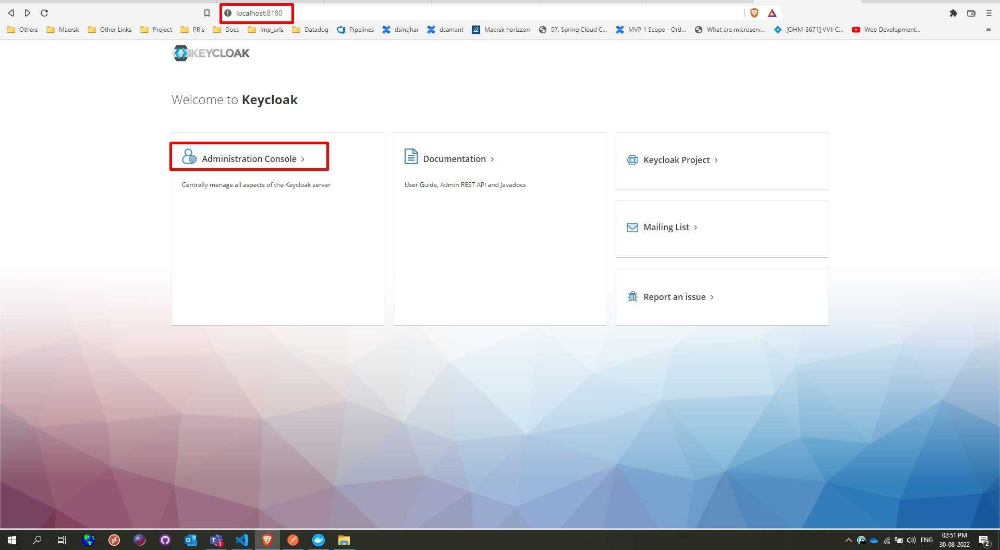

# KeyCloak-for-OAuth2-client-credentials-flow

## Docker Image: 
~~~
docker run --name keycloak_dev -p 8180:8180 -e KEYCLOAK_ADMIN=admin -e KEYCLOAK_ADMIN_PASSWORD=admin quay.io/keycloak/keycloak:latest start-dev --http-port=8180
~~~

## OAuth Grant types:
~~~
"grant_types_supported": [
"authorization_code",
"implicit",
"refresh_token",
"password",
"client_credentials"
],
~~~

URL:
~~~
curl --location --request POST 'http://localhost:8180/realms/realspeed/protocol/openid-connect/token' \
--header 'Content-Type: application/x-www-form-urlencoded' \
--data-urlencode 'client_id=realspeedApi' \
--data-urlencode 'client_secret=7gaXuSygNR8SLrQs4MpMrd7svxdHRoFn' \
--data-urlencode 'grant_type=client_credentials'

ISS: http://localhost:8180/realms/realspeed
KEYSTORE: http://localhost:8180/realms/realspeed/protocol/openid-connect/certs

All Settings:
http://localhost:8180/realms/realspeed/.well-known/openid-configuration
~~~

### Step-1

### Step-2

### Step-3

### Step-4

### Step-5

### Step-6

### Step-7

### Step-8

### Step-9

### Step-10

### Step-11

### Step-12

### Step-13

### Step-14

### Step-15

### Step-16

### Step-17

### Step-18

### Step-19

### Results:

# Other Links:
http://www.mastertheboss.com/keycloak/keycloak-with-docker/
https://www.appsdeveloperblog.com/keycloak-client-credentials-grant-example/
https://www.keycloak.org/
